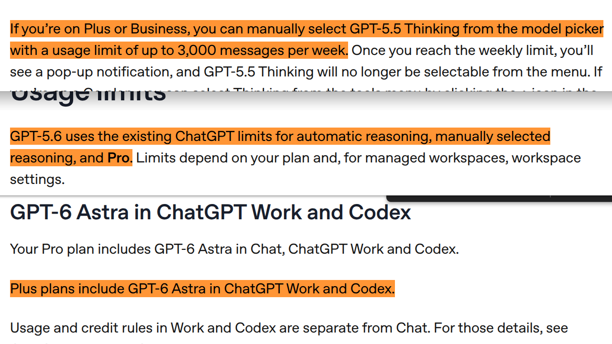

# CatDesk

[English](README.md) | **繁體中文**

一個開源工具，讓你直接把 ChatGPT Chat 模式當成本機 coding agent 用。不做逆向工程、無需 API、不用 Codex/Work 模式，有 ChatGPT Plus 訂閱就行。

<p align="center">
  <br>
  <em>在 ChatGPT 網頁版中使用 CatDesk</em>
</p>

# 免責聲明

這是個獨立的開源專案，與 OpenAI 官方無關。原本只是自用，後決定開源。目前有些功能還有 bug，可能出現非預期行為，請自行承擔使用風險。若因使用本工具造成任何損失，我們不負相關責任。強烈建議放在 VM 或 container 中跑。

# 為什麼要用 CatDesk？

跟 Antigravity（很會 Good Morning）和 Claude Code（5 小時額度上香\|/）相比，Codex 的週額度真的便宜大碗（還經常重置），這也是我們愛 OpenAI 的原因。

<p align="center">
  <br>
  <em>Codex 常常重置用量🙏</em>
</p>

但如果你跑大型的專案，額度還是燒很快。

<p align="center">
  <br>
  <em>Codex 額度重置後第一天就燒完了（舊圖，現在有神聖的 5 小時額度）</em>
</p>

接下來就得等個漫長的 7 天。那這幾天怎麼辦？

答案很簡單：大多數 Plus 使用者連每週 Thinking 訊息額度的 10% 都用不到。

**_那為什麼不把每週 3,000 則訊息拿來寫程式？_**

這就是 CatDesk 的思路！它會把 `write`、`run_command` 這類工具接到 ChatGPT 網頁版，讓 ChatGPT 可以直接改你電腦上的檔案。

<p align="center">
  <br>
  <em>GPT-5.5：<a href="https://web.archive.org/web/20260519111010/https://help.openai.com/en/articles/11909943-gpt-55-in-chatgpt">每週 3,000 則訊息</a><br>
  GPT-5.6：<a href="https://web.archive.org/web/20260710134918/https://help.openai.com/en/articles/20001354-gpt-56-in-chatgpt">「沿用現有 ChatGPT 額度限制」</a>，實際上限不明，但我們從沒撞過上限<br>
  GPT-6 Astra：<a href="https://web.archive.org/web/20260916192117/https://help.openai.com/en/articles/20001354-gpt-56-and-gpt-6-pro-in-chatgpt">Plus 使用者目前無法在 Chat 模式使用</a></em>
</p>

> [!NOTE]
> Custom Connector 本來就是 ChatGPT Chat mode 官方支援的正常功能，用它完全沒問題，也不會因為這樣被 ban。不過我覺得 OpenAI 最後很可能會因為算力不足最終砍了這類工具。可能的做法：
>
> - 對 Custom Connector 加上用量限制
> - 把 Chat 和 Work 模式合併，不再分別計算額度
>
> 最近其實隱約有些跡象。例如 GPT-5.6 Sol High 的 reasoning time 從 102 分鐘縮到 25 分鐘，GPT-6 Sol/Astra 也沒有開放給 Plus 使用者在 Chat 模式用（至少目前如此）。我覺得這類專案大概撐不了太久（可能 2026 年底？），但在那之前我會盡我所能維護 CatDesk。

# CatDesk 如何運作？

1. 你需要 ChatGPT Plus 或更高階的方案。
2. CatDesk 會在你的電腦上跑個本機 MCP server，可以執行指令、修改檔案，功能跟 Codex 類似。
3. 再透過 Custom Connector 把 ChatGPT Web 接到 CatDesk。這個功能目前只有 Plus 和 Pro 使用者能用。
4. 完成！現在 ChatGPT Web 就能操作你的電腦、直接幫你寫程式。

簡單來說：

```text
ChatGPT Web + CatDesk
= 精簡版 Codex
= 少了 cron 和其他主動功能的 OpenClaw
```

我們以前拿 GPT-5.2 測過，效果很破。但現在 **GPT-5.4 Thinking 已經很會呼叫工具和操作電腦了。** 第一次用 GPT-5.4 跑 CatDesk 時，效果非常好。GPT-5.5、GPT-5.6 又更順，尤其 GPT-5.6 很會用 CatDesk，而且速度直接起飛。

# ChatGPT Chat + CatDesk、Codex 和 API 有什麼差別？（以 Plus 為例）

|       | ChatGPT Chat + CatDesk                    | Codex              | OpenAI API       |
| ----- | ----------------------------------------- | ------------------ | ---------------- |
| 用量  | 每週 3,000 則訊息                        | 很大方的每週額度   | 用多少付多少     |
| 優點  | 穩定、不用另外付費，額度幾乎用不完\*  | 穩定、不用另外付費 | 穩定             |
| 缺點  | 沒有原生 Codex 那麼順                    | 額度很快就會用完   | Token 很貴       |

\*假設你每天睡 6 小時，而且每天都在用 CatDesk，那每小時平均可以傳 3,000 / (24 - 6) / 7 = 23.8 則訊息。Thinking 和工具呼叫本身就需要時間，所以實際上很難把每週 3,000 則訊息全部用完。

# 類似專案

如果你不想用 CatDesk，也可以看看這些類似專案：

| 專案 | 說明 |
| --- | --- |
| [Desktop Commander](https://github.com/wonderwhy-er/DesktopCommanderMCP) | 通用型 MCP server，可操作本機檔案、終端機、程序，也支援編輯與自動化。 |
| [DevSpace](https://github.com/Waishnav/devspace) | 自架 MCP server，讓 ChatGPT 和其他支援 MCP 的平台也能有類似 Codex 的開發流程。 |
| [CodexPro](https://github.com/rebel0789/codexpro) | 給 ChatGPT 用的本機 MCP coding 工具，只能操作你明確允許的 repository。 |
| [ChatGPT Local Coder](https://github.com/hoangcoderr/chatgpt-local-coder) | 自架 MCP server，讓 ChatGPT Web 可以操作檔案、Shell、Git、patch，並讀取專案內容。 |
| [Local Coding Agent](https://github.com/LongNgn204/local-coding-agent) | 給 ChatGPT Web 和其他 MCP client 使用的本機 coding workspace。 |
| [Proxide](https://github.com/tt-a1i/proxide) | 不綁特定 agent 的 workspace bridge，可讓網頁版模型透過 MCP 或 browser fallback 操作本機 repository。 |
| [codex-mcp](https://github.com/mollehxh/codex-mcp) | 小型 MCP server，透過 stdio 或 HTTP 提供類似 Codex 的 workspace 操作介面。 |

歡迎直接 fork CatDesk，做你自己的版本！

> [!NOTE]
> 上面列出的專案都不是我們開發或維護的，僅供參考。

# 誰適合用？

- Codex 額度重置沒幾天就用光的人（我們🥺）
- 做 Web 開發或爬蟲的人。（CatDesk 整合了 chrome-devtools-mcp，讓 ChatGPT Web 可以讀取頁面上的元素並控制瀏覽器分頁。）

# 快速開始

> [!CAUTION]
> 這個工具權限很大，理論上可以把整顆硬碟刪光，也可能做出其他非預期操作。
> 請放在 VM 或容器裡執行（DevContainer 是個好選擇）。
> 把它當成 OpenClaw，盡量關在 container 中隔離好。

1. 用 npm 全域安裝 CatDesk。

   ```bash
   npm i -g catdesk --allow-scripts=catdesk
   ```

2. 執行 CatDesk。

   ```bash
   catdesk
   ```

   選擇 `Control Computer`、`Control Browser` 或 `Both`。

   第一次啟動時，請到 [ngrok dashboard](https://dashboard.ngrok.com/get-started/setup) 取得 **ngrok authtoken** 和 **static domain** 並輸入。CatDesk 會儲存設定，下次直接沿用。

3. 等 TUI 顯示 MCP Server URL。

4. 開啟 [ChatGPT connector 設定](https://chatgpt.com/plugins#settings/Connectors?create-connector=true&redirectAfter=%2Fplugins)。

5. 在跳出的視窗裡填入：
   - Name：`CatDesk`，或任何你喜歡的名稱
   - MCP Server URL：CatDesk TUI 顯示的完整 URL
   - Authentication：`None`

6. 點 `I understand and want to continue`。

7. 點 `Create`，再點 `Connect`。

   - 預設權限是 **Allow read actions**。想用順一點的話，建議選 **Allow all actions**（相當於 Codex 的 `--yolo`；請自行評估風險）。

8. 把下面這段加到 ChatGPT 的 `Custom instructions`：

```text
CatDesk is a coding tool and a custom connector. Always use CatDesk if the user wants to do anything related to file operations. Always call `catdesk_instruction` after `list_resources`, and follow the instructions it contains.
```

9. 接下來就可以在 ChatGPT 網頁版用 CatDesk 了。幾個重要提醒：

- 建議讓 ChatGPT 自己決定什麼時候要用哪個 connector。你也可以用 `/` 或 `@` 手動指定 CatDesk；這樣 ChatGPT 只會存取你指定的 connector，有時會比較穩。缺點是 `web.search` 和 `web.open` 會被停用，也就沒辦法搜尋最新資訊。`web` 工具和 custom connector 目前不能同時使用。

<table align="center">
  <tr>
    <td align="center">
      <br>
      <em>用 <code>/</code> 手動選擇 CatDesk</em>
    </td>
    <td align="center">
      <br>
      <em>用 <code>@</code> 手動選擇 CatDesk</em>
    </td>
  </tr>
</table>

- 為了避免越聊越卡、記憶體越吃越多，我們強烈建議**每做一個小功能就開一個新 session**。Library handoff 預設關閉；只有在你能使用 ChatGPT Library Search，而且真的需要跨聊天接續工作時，再到 TUI 設定裡打開。啟用後，換聊天前請 ChatGPT 呼叫 `create_handoff`。CatDesk 會產生一份 `catdesk_handoff_<workspace-name>_<short-id>.md`，裡面會記錄目前目標、已完成項目、重要決定、驗證結果、下一步和 Git 狀態；ChatGPT 接著會把它存進可長期保存的 Library，不會寫進 workspace。下一個 session 呼叫 `catdesk_instruction` 時，ChatGPT 會用完整的 workspace 識別前綴 `catdesk_handoff_<workspace-name>_<short-id>` 搜尋 Library，不會只拿 workspace 名稱去找。如果只找到一份完全符合目前 workspace 的 handoff，就會讀取它，成功讀完後再刪除；如果找到多份，會先問你要用哪一份。不要把憑證、token、密碼或其他機密資料放進 handoff。工具呼叫超過 50 次之後，ChatGPT 畫面可能會開始變得非常卡。
<p align="center">
  <br>
  <em>3.9 GB 記憶體用量🥹</em>
</p>

- 如果你改了 MCP 相關設定（例如 tool mode，或開啟／關閉 widget），需要開新聊天，並到 [設定](https://chatgpt.com/#settings/Plugins) 重新整理 CatDesk。最穩的做法是把 CatDesk 移除後重新安裝一次（步驟 2–7）。

<table align="center">
  <tr>
    <td align="center">
      <br>
      <em>在 ChatGPT 設定裡重新整理 CatDesk</em>
    </td>
    <td align="center">
      <br>
      <em>從 ChatGPT 設定裡移除 CatDesk</em>
    </td>
  </tr>
</table>

# 技術架構

| 項目 | 技術 |
| --- | --- |
| Core | Rust |
| MCP server | 自行實作（不使用 SDK） |
| MCP protocolVersion | `2026-07-28` |
| Server | Axum + Tokio |
| TUI | Ratatui |
| Tunnel | ngrok |
| 瀏覽器控制 | chrome-devtools-mcp |
| Widget | HTML + JavaScript |
| 發布 | npm |

# 工具

CatDesk 有兩種本機工具模式：`multi-tools` 預設有 10 個工具（開啟 Library handoff 後是 11 個）；`read-only` 預設有 3 個（開啟後是 4 個）。

`multi-tools` 模式提供以下工具：

| 工具                    | 類型  | 功能                                                                     |
| ----------------------- | ----- | ------------------------------------------------------------------------ |
| `catdesk_instruction`   | 指南  | 回傳 CatDesk 使用說明並顯示 Binagotchy                                  |
| `read`                  | 讀取  | 讀取 workspace 裡的一個或多個文字檔                                     |
| `search`                | 讀取  | 使用 `rg`、`grep` 或內建搜尋功能搜尋 workspace 內容                      |
| `write`                 | 寫入  | 建立或覆寫檔案                                                           |
| `edit`                  | 寫入  | 以檢查條件保護的方式套用 replace/range 編輯，整批操作會一次完成             |
| `create_handoff`        | 讀取  | 選用：產生這個 workspace 專用的 Library handoff，不會修改 workspace        |
| `delete`                | 寫入  | 刪除檔案或目錄                                                           |
| `run_command`           | Shell | 執行短時間的 Shell 指令並等待完成                                        |
| `start_command`         | Job   | 啟動長時間執行的指令，立即回傳 job ID                                    |
| `poll_command`          | Job   | 讀取背景指令的新輸出與目前狀態                                           |
| `cancel_command`        | Job   | 停止背景指令以及它啟動的子程序                                           |

長時間執行的指令不會綁在單次 MCP HTTP request 上。像是 build、編譯、安裝 dependency、跑大型 test suite 或啟動 development server，都應該用 `start_command`，再拿回傳的 cursor 呼叫 `poll_command`。每次 poll 回傳的內容有大小上限；如果 `hasMoreOutput` 是 true，就算 job 已經結束，也要繼續用 `nextCursor` 往後讀，直到剩餘輸出全部讀完。`run_command` 則適合很快就會跑完的指令，timeout 上限是 120 秒。

如果有開啟瀏覽器模式，CatDesk 還會提供額外的 browser/devtools 工具。這些工具是由 browser bridge 提供，所以實際有哪些工具會依你的環境而定。

`search` 會優先用 `rg`；找不到時改用 `grep`，最後才用 CatDesk 內建的搜尋功能。不裝 ripgrep 也能用，但裝了之後搜尋速度和行為會比較理想。

# Context window

根據[這篇文章](<https://help.openai.com/en/articles/11909943-gpt-53-and-gpt-54-in-chatgpt#:~:text=Thinking%20(GPT%E2%80%915.4%20Thinking)>)和[這段程式碼](https://github.com/openai/codex/blob/main/codex-rs/models-manager/src/model_info.rs#L85)，ChatGPT Web 和 Codex 的 context window 不一樣。

| 方案 | CatDesk + ChatGPT Web（in + out = 總和） | Codex CLI（總和）       |
| ---- | ---------------------------------------- | ----------------------- |
| Plus | 128K + 128K = 256K                       | 258K（1M experimental） |
| Pro  | 272K + 128K = 400K                       | 258K（1M experimental） |

# FAQ

## 可以把紅色 CSP 按鈕關掉嗎？

<table align="center">
  <tr>
    <td align="center">
      <br>
      <em>紅色 CSP 按鈕</em>
    </td>
    <td align="center">
      <br>
      <em>Advanced connector settings 裡的 <code>Enforce CSP in developer mode</code></em>
    </td>
  </tr>
</table>

可以。打開 [Advanced connector settings](https://chatgpt.com/#settings/Connectors/Advanced)，啟用 `Enforce CSP in developer mode` 就會把那顆紅色按鈕拿掉。CatDesk 會自動把目前的 ngrok domain 加進 widget 的 CSP，所以開啟 CSP enforcement 後，widget 應該還是能正常使用。

## 明明已經連過了，為什麼還一直叫我 Connect？

目前看不出 connector 會在什麼情況下重新要求 `Connect`。可以確定跟 tool call 次數無關，但真正的觸發原因我們也不知道。

<table align="center">
  <tr>
    <td align="center">
      <br>
      <em>Connector 又要求重新連線</em>
    </td>
    <td align="center">
      <br>
      <em>點 Continue 之後又要求重新連線</em>
    </td>
  </tr>
</table>

看起來這是 ChatGPT 的 bug，而且現在已經修好了 🥳。

## CatDesk 可以用在其他 App 嗎？

理論上可以。只要 App 支援自訂遠端 MCP server，CatDesk 都有機會能用，包括 Claude。（不過我們不太覺得會有人拿 CatDesk 配 Claude，因為 Claude Chat mode 和 Claude Code 共用同一份使用額度。）

CatDesk 主要還是針對 ChatGPT Chat 和它的 Custom Connector 流程開發。（這個功能先被改名成 _Apps_，後來又改成 _Plugins_；但為了避免和一般的 _Application_ 搞混，我們還是比較習慣叫它 _Connector_。）CatDesk 的主要開發和測試環境都是 ChatGPT Chat，所以放到其他 App 上不一定會一樣順。

## Input/output token 怎麼算？

CatDesk 拿不到 ChatGPT Web 官方的 token usage，所以是自己在本機用 `o200k_base` 估算。它和 GPT-5.5 類模型使用的是同一個 tokenizer family，因此數字可以拿來參考，但終究只是估算值。

| 欄位           | 符號 | 代表什麼                     | 價格                           |
| -------------- | ---- | ---------------------------- | ------------------------------ |
| `inputTokens`  | `↓`  | Tool input ≈ LLM output      | ≈ `$30.00 / 1M` output tokens  |
| `outputTokens` | `↑`  | Tool output ≈ LLM input      | ≈ `$5.00 / 1M` input tokens    |
| `totalTokens`  | `Σ`  | `inputTokens + outputTokens` | `input price + output price`   |

CatDesk 不會把這些算進去：

- 完整的 ChatGPT 對話內容
- 隱藏的 prompt 或 reasoning token
- OpenAI 內部使用的其他 token

載入動畫是純視覺效果。ChatGPT 網頁版不會把 MCP tool 的部分 input/output 即時串流到 CatDesk，所以 widget 會先自己放動畫，等真正的 tool result 回來後，再顯示最後的估算值。

## Workspace 是什麼？

Workspace 就是 CatDesk 可以操作的根目錄。

預設是你啟動 CatDesk 時所在的目錄，也可以用 `WORKSPACE_ROOT` 指定其他位置。

所有檔案工具都會以這個目錄為基準；超出 workspace 的路徑會直接被拒絕。

## AGENTS.md 要放哪裡？

可以放這 3 個地方：

1. Workspace root
2. `~/.catdesk/AGENTS.md`
3. `~/.codex/AGENTS.md`

CatDesk 會照這個順序找 `AGENTS.md`。每次呼叫 `catdesk_instruction` 都會重新檢查，你也可以手動指定要用哪一份。

<p align="center">
  <br>
  <em>手動指定 AGENTS.md</em>
</p>

## Widget 一片空白怎麼辦？

<p align="center">
  <br>
  <em>空白的 widget/function call</em>
</p>

1. 直接重新整理頁面，再重新連接 connector。
2. 停止這次回覆，重新送一次訊息。

這是 ChatGPT 端的 bug，我們這邊沒辦法修，改 CatDesk 的程式碼也不會有用。這個 bug 可能是在 4 月 15 日左右出現的。

# 安全性

> [!CAUTION]
> **絕對不要**把 `MCP Server URL` 分享給任何人。任何拿到這個 URL 的人，都可能存取你的電腦。

這個 URL 由三個部分組成：

| 部分         | 範例                          | 用途                           |
| ------------ | ----------------------------- | ------------------------------ |
| Public URL   | `https://xxxx.ngrok-free.dev` | 你的 ngrok static domain       |
| Random path  | `/Ab3kL9xQ2pTm7VhC`           | 第一次啟動時隨機產生的路徑     |
| MCP endpoint | `/mcp`                        | MCP 實際使用的 endpoint        |

完整 URL 會長這樣：

```text
https://xxxx.ngrok-free.dev/Ab3kL9xQ2pTm7VhC/mcp
```

Static domain 和 random path 都會存在 `~/.catdesk/config.toml`，所以每次啟動時 MCP URL 都會維持不變。Connector 設定一次就好。

# 關於 Binagotchy

<p align="center">
  <br>
  <em>Binagotchy!</em>
</p>

是一隻可愛的鯊貓！其實 Binagotchy 比 CatDesk 更早做好，只是後來我們決定把它一起放進這個專案。

CatDesk 每次啟動時預設都會隨機產生一隻 Binagotchy。有看到喜歡的可以直接在啟動畫面設為夥伴。所有產生過的 Binagotchy 都會自動存到 `~/.catdesk/binagotchy`，也可以匯出成 `.png` 或 `.gif`，想用在哪都行。CatDesk 和 Binagotchy 都是 MIT License。另外，Binagotchy 完全是用腳本生成的，並沒有用到任何 text-to-image 或 diffusion model。
